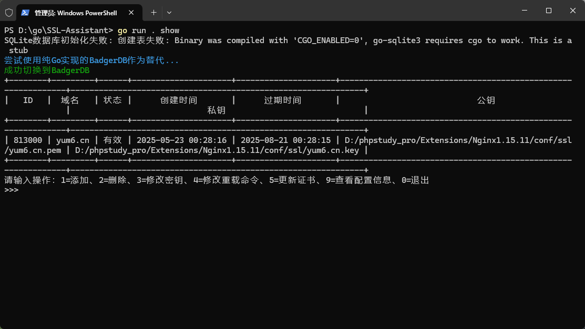

# SSL Assistant 🛡️ SSL证书部署管理助手


[](https://github.com/Youngxj/SSL-Assistant/issues)
[](https://github.com/Youngxj/SSL-Assistant/releases)

## 项目简介 🌟

> 该项目主要是为了解决大家在使用自动化证书申请平台，如 [Certd](https://github.com/certd/certd) 🚀
> 时，证书部署服务器密钥填写在平台中可能出现的安全问题，同时又有多个站点需要部署证书的场景，SSL Assistant 可以有效的帮助大家解决这个问题。

SSL Assistant 是一个基于 Go 语言开发的跨平台证书部署管理助手 🤖，用于SSL远程证书拉取，并自动完成SSL证书更新及生效流程。该工具支持
Windows 和 Linux 平台 🖥️，可以自动寻找 Nginx 服务对应站点的配置文件，获取域名和证书信息，并将证书信息保存到数据库中。
可通过计划任务定期更新证书，实现 SSL 证书的自动更新和部署 ⏰。

<p align="center">
  
</p>

## 功能特点 ✨

- 跨平台支持：同时支持 Windows 和 Linux 系统 🖼️
- 自动化管理：自动寻找 Nginx 配置文件（已兼容宝塔面板），获取域名和证书信息 🧐
- 证书更新：主动拉取远程证书信息，自动更新证书部署，并自动重载生效 🔄
- 命令行操作：提供简单易用的命令行界面 💻
- 本地存储：使用 SQLite / BadgerDB 数据库存储证书信息 🗄️

## TODO 📝

- [x] 支持 Windows 和 Linux 平台 🎉
- [x] 手动指定 Nginx 配置目录 ✅
- 支持自动寻找 Nginx 配置文件
    - [x] 原生Nginx环境 🐱‍🏍
    - [x] [宝塔面板](https://bt.cn) 🏰
    - [ ] [小皮面板Windows](https://www.xp.cn) 🐘
    - [ ] [小皮面板](https://www.xp.cn) 🐘
    - [ ] [1Panel](https://1panel.cn) 📦
- [x] 支持自动获取证书信息 🔍
- 支持更多证书申请管理工具
    - [x] [Certd](https://github.com/certd/certd) 流水线申请部署证书工具 🏭
    - [ ] [ALLinSSL](https://allinssl.com/) 🔒
    - [ ] 更多…… 📈
- [x] 本地证书与云端证书一致性校验，一致的话则不更新证书，减少重载次数 🔗
- [ ] 内部配置定时更新任务，支持每天或每周定期检查并更新证书 ⏲️

## 安装与使用 📥

1. 下载对应平台的运行文件 [Releases 下载页面](https://github.com/Youngxj/SSL-Assistant/releases) ⬇️
2. 初始化程序：`SSL-Assistant init` 根据提示完成初始化配置，填写API地址、API密钥、重载命令等信息 ⚙️
3. 添加证书：`SSL-Assistant add` 输入域名，程序会自动根据域名获取证书信息，并将证书信息保存到数据库中，以便后面的更新操作 ➕
4. 定期更新：可使用Crontab设置定时任务定期执行`SSL-Assistant update` ，自动更新部署证书 🔁

## 使用方法 📖

### 初始化 🚀

```bash
SSL-Assistant init
```

初始化程序，设置证书信息获取的凭证和证书更新后需要执行的命令。初始化完成后，程序会自动寻找 Nginx 配置文件，获取域名和证书信息。

### 添加证书 📝

```bash
SSL-Assistant add
```

手动添加证书信息，程序会自动根据域名获取证书信息，并将证书信息保存到数据库中，以便后面的更新操作。

### 更新证书 🔄

```bash
SSL-Assistant update
```

更新证书，程序会自动获取所有证书信息，并将证书信息保存到数据库中，更新证书对应域名的证书文件内容，重载并生效。

### 查看证书信息 📋

```bash
SSL-Assistant show
```

查看证书，显示证书信息的表格，包括 ID、域名、状态、创建时间、过期时间、证书路径、私钥路径等信息。

### 删除证书 🗑️

```bash
SSL-Assistant del
```

删除指定域名的证书信息，包括证书文件、证书配置等。

### 帮助文档 📚

```bash
SSL-Assistant -h
```

查看帮助文档，了解所有可用命令及其用法。

## 计划任务设置 ⏰

### Windows 🪟

1. 打开任务计划程序
2. 创建基本任务
3. 设置触发器为每天或每周
4. 设置操作为启动程序，程序为 SSL-Assistant，参数为 update

### Linux 🐧

使用 crontab 设置定时任务：

```bash
crontab -e
```

添加以下内容：

```plainText
30 1 * * * /usr/local/bin/SSL-Assistant update
```

## 配置文件 📄

配置文件存储在用户主目录的 `.ssl_assistant` 文件夹中：

Windows: `C:\Users\<username>\.ssl_assistant`

Linux: `/home/<username>/.ssl_assistant`

## 注意事项 ⚠️

1. 确保程序有足够的权限读取 Nginx 配置文件和写入证书文件 🔑
2. 证书更新后会自动执行重载命令，请确保命令正确 ✔️
3. 定期检查证书状态，确保证书有效 🔎

## 开发流程 🛠️

### 从源码编译 👨‍💻

克隆仓库

```bash
git clone https://github.com/Youngxj/SSL-Assistant.git
cd SSL-Assistant
```

编译项目

```bash
go build -o ssl_assistant
```

将可执行文件添加到系统路径或直接 `./ssl_assistant init` 运行