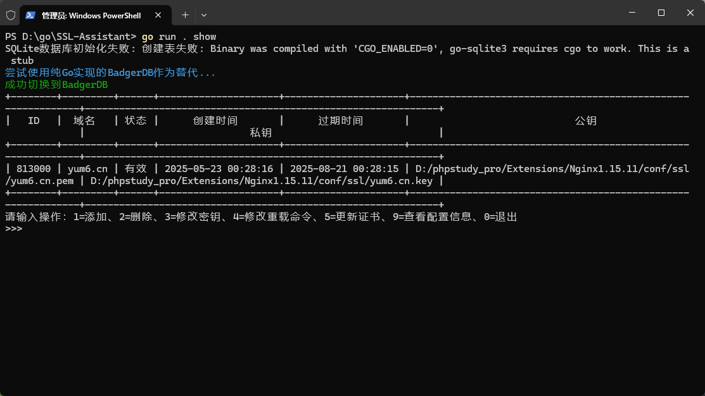

# SSL Assistant 🛡️ SSL证书部署管理助手


[](https://github.com/Youngxj/SSL-Assistant/issues)
[](https://github.com/Youngxj/SSL-Assistant/releases)

## 项目简介 🌟

> 该项目主要是为了解决大家在使用自动化证书申请平台，如 [Certd](https://github.com/certd/certd) 🚀
> 时，证书部署服务器密钥填写在平台中可能出现的安全问题，同时又有多个站点需要部署证书的场景，SSL Assistant 可以有效的帮助大家解决这个问题。

SSL Assistant 是一个基于 Go 语言开发的跨平台证书部署管理助手 🤖，用于SSL远程证书拉取，并自动完成SSL证书更新及生效流程。该工具支持
Windows、Linux 和 macOS 平台 🖥️，可以自动寻找 Nginx 服务对应站点的配置文件，获取域名和证书信息，并将证书信息保存到数据库中。
可通过计划任务定期更新证书，实现 SSL 证书的自动更新和部署 ⏰。

<p align="center">
  
</p>

## 功能特点 ✨

- 跨平台支持：同时支持 Windows 和 Linux 系统 🖼️
- 自动化管理：自动寻找 Nginx 配置文件（已兼容宝塔面板、1Panel），获取域名和证书信息 🧐
- 证书更新：主动拉取远程证书信息，以**证书文件实际过期时间**判断是否需要更新，自动部署并重载生效 🔄
- 多渠道证书：支持多种证书申请管理工具，如 Certd、西部数码等 📡
- 自动申请：证书不存在时可触发 Certd 自动创建流水线申请新证书（需在初始化时开启）🚀
- 自动匹配路径：添加证书时自动从 Nginx/宝塔配置匹配证书存放路径，无需手动输入 📂
- 站点勾选批量添加：检索到站点后支持**方向键勾选**（↑/↓ 移动、空格勾选、回车确认）或序号输入批量添加 ☑️
- 检查更新：内置 `checkupdate` 检查新版本并输出下载地址（不自动下载）🔍
- 命令行操作：提供简单易用的命令行界面；Windows 支持**双击进入交互菜单** 💻
- 本地存储：使用 SQLite / BadgerDB 数据库存储证书信息 🗄️
- 计划任务：支持定期更新证书，实现 SSL 证书的自动更新和部署 ⏰
- 自动测试：内置单元测试与 GitHub Actions CI，保障代码质量 ✅

## TODO 📝

- [x] 支持 Windows 和 Linux 平台 🎉
- [x] 手动指定 Nginx 配置目录 ✅
- [x] 初始化自动检索 Nginx 配置，无需手动输入路径 ✅
- 支持自动寻找 Nginx 配置文件
    - [x] 原生Nginx环境 🐱‍🏍
    - [x] [宝塔面板](https://bt.cn) 🏰
    - [x] [1Panel](https://1panel.cn) 📦
    - [ ] [小皮面板Windows](https://www.xp.cn) 🐘
    - [ ] [小皮面板](https://www.xp.cn) 🐘
- [x] 支持自动获取证书信息 🔍
- [x] 添加证书自动匹配 Nginx/宝塔配置中的证书路径 📂
- [x] Certd 证书不存在时自动申请（autoApply）🚀
- [x] 证书ID（certId）持久化，更新时优先按证书ID拉取 🔢
- 支持更多证书申请管理工具
    - [x] [Certd](https://github.com/certd/certd) 流水线申请部署证书工具 🏭
    - [x] [西部数码](https://www.west.cn/web/ssl/manage/) 证书管理平台 📡
    - [ ] [ALLinSSL](https://allinssl.com/) 🔒
    - [ ] 更多…… 📈
- [x] 本地证书与云端证书一致性校验，一致的话则不更新证书，减少重载次数 🔗
- [x] 以证书文件实际过期时间判断是否更新，避免漏更新过期证书 ⏲️
- [x] 内部配置定时更新任务，支持每天或每周定期检查并更新证书 ⏲️
- [x] 检查更新（checkupdate）：查询最新版本并输出下载地址 🔍
- [x] Windows 双击 exe 进入交互菜单 🖱️
- [x] 站点检索支持方向键勾选批量添加 ☑️
- [ ] 增加通信能力，支持三方证书平台主动投送证书信息，并自动更新证书 📡

## 安装与使用 📥

1. 下载对应平台的运行文件 [Releases 下载页面](https://github.com/Youngxj/SSL-Assistant/releases) ⬇️
2. 初始化程序：`SSL-Assistant init` 根据提示完成初始化配置，填写API地址、API密钥、重载命令等信息。初始化时会自动检索宝塔/1Panel/原生 Nginx 的配置文件并导入证书，无需手动输入路径 ⚙️
3. 添加证书：`SSL-Assistant add` 输入域名，程序会自动根据域名获取证书信息，并自动匹配 Nginx/宝塔配置中的证书路径，保存到数据库，以便后面的更新操作 ➕
4. 定期更新：可使用Crontab设置定时任务定期执行`SSL-Assistant update` ，自动更新部署证书 🔁

### Windows 双击运行 🖱️

Windows 用户可以直接**双击 `SSL-Assistant.exe`** 启动，程序会打开一个交互菜单，无需在 cmd 中手动输入命令：

```
========== SSL Assistant 操作菜单 ==========
  1. 初始化程序      (init)
  2. 添加证书        (add)
  3. 删除证书        (del)
  4. 查看证书        (show)
  5. 更新证书        (update)
  6. 快速添加域名    (find)
  7. 证书更新任务    (cron)
  8. 显示版本信息    (version)
  9. 检查更新        (checkupdate)
  0. 退出
============================================
```

输入菜单项对应的数字即可执行操作，完成后自动返回菜单，选择 `0` 退出。

> 从 cmd / PowerShell 带参数运行（如 `SSL-Assistant.exe show`、`SSL-Assistant.exe update`）时行为不变，仍为普通命令行模式，适合计划任务等自动化场景。

## 使用方法 📖

### 初始化 🚀

```bash
SSL-Assistant init
```

初始化程序，设置证书信息获取的凭证和证书更新后需要执行的命令。初始化完成后，程序会自动寻找宝塔/1Panel/原生 Nginx 的配置文件，**列出所有检索到的域名**进行勾选。终端下使用**方向键 ↑/↓ 移动高亮、空格勾选、回车确认**（ESC 取消）；非终端环境（管道/脚本）自动回退为序号输入模式。确认后自动将勾选的域名添加到服务中。

```
  [ ] 1. example.com      ← ↑/↓ 移动高亮
> [x] 2. www.example.com  ← 空格切换勾选
  [ ] 3. test.com         ← 回车确认，ESC 取消
```

> 自动检索到证书配置后不会再询问自定义路径；仅当默认路径（宝塔 `/www/server/panel/vhost/nginx/*.conf`、1Panel `/opt/1panel/www/conf.d/*.conf`、`/etc/nginx` 等）未找到证书时，才提示可手动补充（直接回车跳过）。

### 添加证书 📝

```bash
SSL-Assistant add
```

手动添加证书信息，程序会自动根据域名获取证书信息。若该域名在 Nginx/宝塔配置中存在，会**自动匹配证书与私钥路径**（可确认使用）；未匹配到才需要手动输入路径。

### 更新证书 🔄

```bash
SSL-Assistant update
```

更新证书，程序会以**证书文件的实际过期时间**判断是否需要更新（提前 N 天，默认 10 天），过期或临近过期时自动拉取最新证书，更新证书文件并重载生效。

> 即使数据库记录显示证书有效，只要站点上的证书文件已过期/临近过期，也会触发更新，避免漏更新。

### 查看证书信息 📋

```bash
SSL-Assistant show
```

查看证书，显示证书信息的表格，包括 ID、域名、状态、创建时间、过期时间、证书路径、私钥路径等信息。

### 删除证书 🗑️

```bash
SSL-Assistant del
```

删除指定域名的证书信息，包括证书文件、证书配置等。

### 快速添加域名（Nginx目录检索）🕵️‍♂️

```bash
SSL-Assistant find
```

快速添加域名，程序会自动寻找 Nginx 配置文件（支持自定义路径），**列出所有检索到的域名**进行勾选（终端下方向键 ↑/↓ + 空格勾选 + 回车确认，非终端回退序号输入），确认后自动将勾选的域名添加到服务中，以便后面的更新操作。

自定义 Nginx 路径支持三种写法（每行一个，输入空行结束）：

1. **目录**：自动匹配该目录下所有 `*.conf`（如 `/etc/nginx/conf.d`、`C:\nginx\conf\vhosts`）
2. **单个文件**（如 `/etc/nginx/nginx.conf`）
3. **通配符**（如 `/www/server/panel/vhost/nginx/*.conf`）

### 证书更新任务 ⏰

```bash
SSL-Assistant cron &
```

**crontab 二选一即可**

证书更新自动化任务，每日凌晨4点自动检测证书更新，并执行证书更新操作。

运行此命令后，无需再次执行 `SSL-Assistant update` 命令，程序会自动检测证书更新并执行证书更新操作。

> 任务运行期间，程序会记录运行日志，日志文件位于程序运行目录下的`cron.log`文件中

### 检查更新 🔄

```bash
SSL-Assistant checkupdate
```

检查是否有新版本，并**输出下载地址**（不会自动下载更新）。无法访问 GitHub 的网络环境（如受防火墙/代理限制）会提示失败，并给出可手动访问的下载页面：

```
https://github.com/Youngxj/SSL-Assistant/releases/latest
```

Windows 双击启动的菜单中也提供了"9. 检查更新"选项。

### 帮助文档 📚

```bash
SSL-Assistant -h
```

查看帮助文档，了解所有可用命令及其用法。

## 计划任务设置 ⏰

### Windows 🪟

1. 打开任务计划程序
2. 创建基本任务
3. 设置触发器为每天或每周
4. 设置操作为启动程序，程序为 SSL-Assistant，参数为 update

### Linux 🐧

使用 crontab 设置定时任务：

```bash
crontab -e
```

添加以下内容：

```plainText
30 1 * * * /usr/local/bin/SSL-Assistant update
```

## 数据库文件 📄

证书数据库文件存储在用户主目录的 `.ssl_assistant` 文件夹中：

Windows: `C:\Users\<username>\.ssl_assistant`

Linux: `/home/<username>/.ssl_assistant`

- 使用 SQLite（CGO 模式）时数据文件为 `ssl_assistant.db`
- 使用 BadgerDB（纯 Go 模式，CGO 不可用或未开启时自动降级）时数据在 `badger/` 子目录

## 配置文件 📋

配置文件放在程序运行目录下`config/conf.ini`

可手动修改或使用命令`SSL-Assistant show`或`SSL-Assistant init`修改相关配置

常用配置项：

| 配置键 | 说明 |
| --- | --- |
| `restart_cmd` | 证书更新后执行的重载命令，支持引号/管道等 Shell 语法（如 `docker restart $(docker ps -aqf "name=openresty")`） |
| `before_expiration_day` | 证书过期前多少天触发更新（默认 10） |
| `third.certd.api_url` / `key_id` / `key_secret` | Certd 开放接口地址与凭证 |
| `third.certd.auto_apply` | 证书不存在时是否触发 Certd 自动申请（`1` 开启） |
| `third.certd.auto_apply_template_id` | 自动申请使用的证书参数模版 ID（可选） |
| `third.certd.auto_apply_renew_days` | 自动申请时到期前多少天更新（默认 10） |
| `third.west.username` / `api_key` | 西部数码平台用户名与 API 密钥 |

## 重载命令 🔄

重载命令用于SSL证书内容更新后更新服务，命令通过系统 Shell 执行（Linux `sh -c` / Windows `cmd /C`），支持引号、管道、`$(...)` 等语法，并有 60 秒超时保护

- Nginx：`nginx -s reload`
- 1Panel：`docker restart $(docker ps -aqf "name=openresty")`
  > 1Panel因为采用了Docker容器化部署，所以需要重启容器才能生效，可能会出现服务中断问题

## 注意事项 ⚠️

1. 确保程序有足够的权限读取 Nginx 配置文件和写入证书文件 🔑
2. 证书更新后会自动执行重载命令，请确保命令正确 ✔️
3. 定期检查证书状态，确保证书有效 🔎

## 常见问题 ❓

### 在 crontab / 脚本中运行提示"不支持交互输入"？
`add`、`show` 等命令在未初始化且标准输入不是终端时会提示先执行 `init`，避免卡死。若确认当前处于交互终端（如 Windows git-bash 伪终端无法被自动识别），可设置环境变量强制进入交互模式：

```bash
SSL_ASSISTANT_INTERACTIVE=1 SSL-Assistant init
```

### `checkupdate` 提示无法访问 GitHub？
部分网络环境无法访问 GitHub API（防火墙/代理限制或触发未认证限流）。程序不会卡住，会直接给出可手动访问的下载页面：

```
https://github.com/Youngxj/SSL-Assistant/releases/latest
```

### 证书文件权限是怎样的？
公钥（证书）写入权限为 `0644`，**私钥写入权限为 `0600`**（仅所有者可读写，Linux 下生效）。

### SQLite 与 BadgerDB 怎么选择？
- CGO 可用（`CGO_ENABLED=1`，需 gcc 环境）：默认使用 SQLite
- CGO 不可用（如 `CGO_ENABLED=0` 纯 Go 编译）：自动降级使用 BadgerDB
- 两种模式的数据库**不互通**，切换模式后需重新添加证书

### 版本号从哪里来？
版本号通过编译参数注入，正式发布版本形如 `v1.2.1`：

```bash
go build -ldflags "-X main.Version=v1.2.1" -o ssl_assistant
```

本地直接 `go build` 不带参数时版本号为空，`checkupdate` 会提示"当前版本未知"，仍会输出最新版本与下载地址。

## 开发流程 🛠️

### 从源码编译 👨‍💻

克隆仓库

```bash
git clone https://github.com/Youngxj/SSL-Assistant.git
cd SSL-Assistant
```

编译项目

```bash
make build        # 自动注入 git 版本号（tag 或最近提交哈希），推荐
go build -o ssl_assistant   # 纯编译（不注入版本号，checkupdate 会显示"版本未知"）
```

将可执行文件添加到系统路径或直接 `./ssl_assistant init` 运行

> 发布时版本号由 GoReleaser 自动注入（`.goreleaser.yaml` 的 `-X main.Version={{.Version}}`），打 tag 触发 CI 即自动带版本，无需手动。

### 运行测试 ✅

项目内置单元测试（Nginx 配置解析、数据库双实现 CRUD、Certd 接口、GitHub 版本查询、配置缓存），SQLite 与 BadgerDB 两种模式均可运行：

```bash
go test ./...            # 默认 CGO 模式（SQLite）
CGO_ENABLED=0 go test ./...   # 纯 Go 模式（BadgerDB）
```

### 持续集成 🚀

GitHub Actions（`.github/workflows/go.yml`）会在 push 到 `main` 或提交 PR 时自动运行双模式测试与 `go vet`；推送 `v*` tag 时测试通过后自动发布 Release。

### 多端一键编译 👨‍💻

```bash
goreleaser release --snapshot
```

### 切换为CGO模式

CGO主要用于Sqlite3数据库

```bash
go env -w CGO_ENABLED=1
```

如果不使用Sqlite3数据库，则会自动使用BadgerDB数据库
